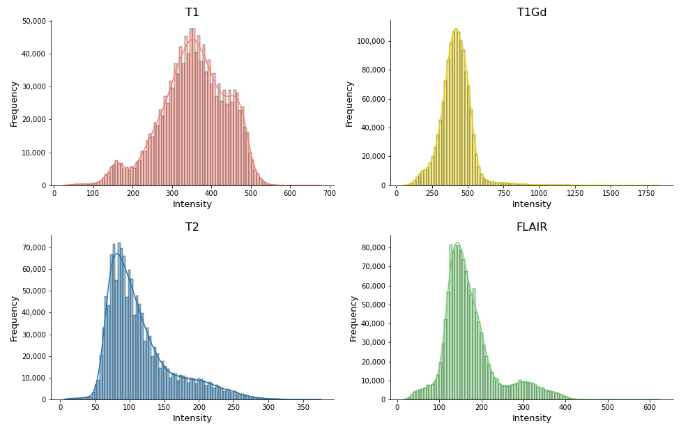
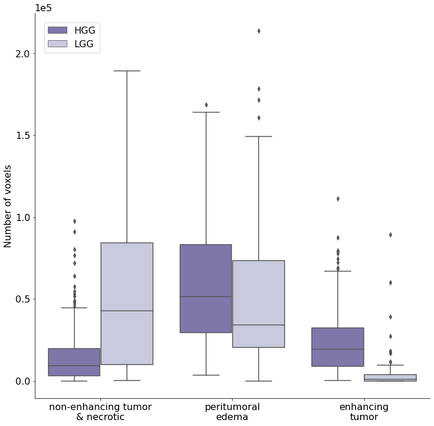
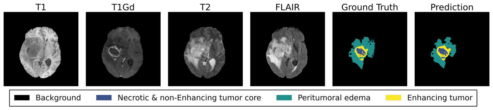

# BTS U-Net: A Data-Driven Approach to Brain Tumor Segmentation

## Overview
BTS U-Net is a novel lightweight deep learning architecture for brain tumor segmentation in magnetic resonance 
imaging (MRI). The model prioritizes efficiency and sustainability without sacrificing performance, making 
it ideal for scenarios with limited computational resources. This repository includes the code and results 
from the study, which outperformed some traditional architectures in key metrics while maintaining computational 
simplicity. BTS U-Net reduces training time by up to 79.2% while achieving comparable 
performance, with DICE scores of 0.811, 0.878, and 0.908 for the region Enhancing Tumor (ET), 
Tumor Core (TC), and Whole Tumor (WT), respectively. Additionally, the study highlights the importance of 
glioma grading for segmentation accuracy, suggesting that a two-step approach—classification followed by segmentation—yields better results.

The main contributions of the work are the following:

- We propose a novel efficient lightweight architecture that outperforms some of the most popular architectures previously used in biomedical image segmentation, such as U-Net [7] or V-Net [8]. Our model offers significantly lower training and computational requirements while achieving comparable performance.

- The study shows statistical differences between LGG and HGG, and suggests a potential shift in glioma segmentation strategies to optimize outcomes, especially for HGG tumors, the most aggressive ones.

- We prove that the brain tumor segmentation problem can be effectively approached in a 2-step way by  first classifying the type of glioma between HGG and LGG, and then segmenting the MRI

## Methodology
### Data
The model was trained on the BraTS 2020 dataset, which contains multi-modal MRI scans (T1, T1-Gd, T2, and FLAIR)
of gliomas. The dataset was split into training (80%), validation (10%), and test (10%) subsets, with 
appropriate preprocessing including voxel normalization, cropping, and augmentation.

### Model Architecture
BTS U-Net builds on the U-Net architecture with the following enhancements:
1. **Extra Skip Connection:** Captures multi-level features.
2. **Instance Normalization:** Improves memory efficiency and handles variability in input distributions.
3. **Leaky ReLU Activation:** Addresses the dying ReLU problem.
4. **Deep Supervision:** Incorporates intermediate layers into the loss calculation for better performance.

These features make BTS U-Net both efficient and effective, using significantly fewer parameters than comparable models.

## Results

### MRI characteristics and masks analysis

The analysis of MRI sequences revealed that the pixel intensity distributions are significantly different between
High-Grade Gliomas (HGG) and Low-Grade Gliomas (LGG). These findings align with medical knowledge, as HGG 
typically have more distinct features due to their aggressive and infiltrative nature. LGG, being slower-growing
and less infiltrative, exhibit subtler changes in MRI characteristics, making them harder to distinguish.

The analysis of segmentation masks provided by radiologists further reinforced the findings from the MRI characteristics study.

### Comparative Performance

2. The study demonstrated improved performance when segmenting HGG separately, supporting the use of a two-step pipeline:
   - **Step 1:** Classify tumor type (HGG vs. LGG)
   - **Step 2:** Perform segmentation using a model fine-tuned for the specific tumor type.

BTS U-Net was compared against established architectures like U-Net, V-Net, and nnU-Net. Key findings include:
- **Training Time:** Up to 79.2% faster than nnU-Net.
- **Performance:** Comparable performance with significantly fewer parameters (5M vs. nnU-Net's 33M).

| Model         | No. Parameters | Size (MB) | FLOPs (10¹²) | Training Time/Epoch (s) | Val Cohort - ET | Val Cohort - TC | Val Cohort - WT |
|---------------|------------|-------|----------|--------------------|-----------------|------------|-------------|
| 3D U-Net      | 16M        | 72.8  | 5.17     | 301                | 0.698      | 0.783       | 0.877       |
| V-Net         | 45M        | 174.0 | 2.13     | 187                | 0.635      | 0.699       | 0.867       |
| SegResNet     | 11M        | 40.3  | 0.91     | 228                | 0.776      | 0.832       | 0.893       |
| nnU-Net       | 33M        | 127.3 | 50.80    | 230                | 0.791      | 0.843       | 0.903       |
| **BTS U-Net** | 5M         | 18.8  | 1.41     | 168                | 0.790      | 0.841       | 0.901       |

Qualitative results are displayed below:

